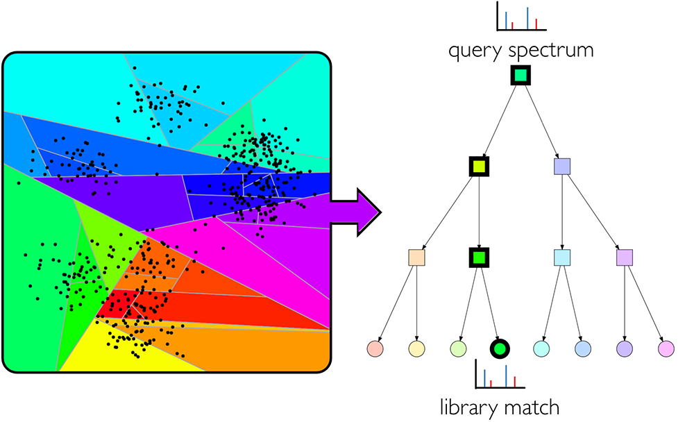

ANN-SoLo
========

For more information:

* [Official code website](https://github.com/bittremieux/ANN-SoLo)

**ANN-SoLo** (**A**pproximate **N**earest **N**eighbor **S**pectral **L**ibrary) is a spectral library search engine for fast and accurate open modification searching. ANN-SoLo uses approximate nearest neighbor indexing to speed up open modification searching by selecting only a limited number of the most relevant library spectra to compare to an unknown query spectrum. This is combined with a cascade search strategy to maximize the number of identified unmodified and modified spectra while strictly controlling the false discovery rate and the shifted dot product score to sensitively match modified spectra to their unmodified counterpart.

The software is available as open-source under the Apache 2.0 license.

If you use ANN-SoLo in your work, please cite the following publications:

- Wout Bittremieux, Pieter Meysman, William Stafford Noble, Kris Laukens. **Fast Open Modification Spectral Library Searching through Approximate Nearest Neighbor Indexing.** _Journal of Proteome Research_ (2018). [doi:10.1021/acs.jproteome.8b00359](https://doi.org/10.1021/acs.jproteome.8b00359)

- Wout Bittremieux, Kris Laukens, William Stafford Noble. **Extremely Fast and Accurate Open Modification Spectral Library Searching of High-Resolution Mass Spectra Using Feature Hashing and Graphics Processing Units.** _Journal of Proteome Research_ (2019). [doi:10.1021/acs.jproteome.9b00291](https://doi.org/10.1021/acs.jproteome.9b00291)

- Issar Arab, William E. Fondrie, Kris Laukens, and Wout Bittremieux. **Semisupervised Machine Learning for Sensitive Open Modification Spectral Library Searching.** _Journal of Proteome Research_ (2023). [doi:10.1021/acs.jproteome.2c00616](https://doi.org/10.1021/acs.jproteome.2c00616)

Running ANN-SoLo
----------------

See the [wiki](https://github.com/bittremieux/ANN-SoLo/wiki) for detailed instructions on how to install and run ANN-SoLo.

ANN-SoLo requires Python 3.6 to 3.9 (Python 3.10 and newer are currently not supported yet). The GPU-powered version of ANN-SoLo can be used on Linux systems with an NVIDIA CUDA-enabled GPU device, while the CPU-only version supports both the Linux and OSX platforms. Please refer to the Faiss installation instructions linked below for more information on OS and GPU support.

### Installation requirements

- **NumPy** needs to be available prior to the installation of ANN-SoLo.
- The **Faiss** installation depends on a specific GPU version. Please refer to the [Faiss installation instructions](https://github.com/facebookresearch/faiss/blob/master/INSTALL.md) for more information.

### Install ANN-SoLo

The recommended way to install ANN-SoLo is using pip:

    pip install ann_solo

Contact
-------

For more information you can visit the [official code website](https://github.com/bittremieux/ANN-SoLo) or send an email to <wout.bittremieux@uantwerpen.be>.
